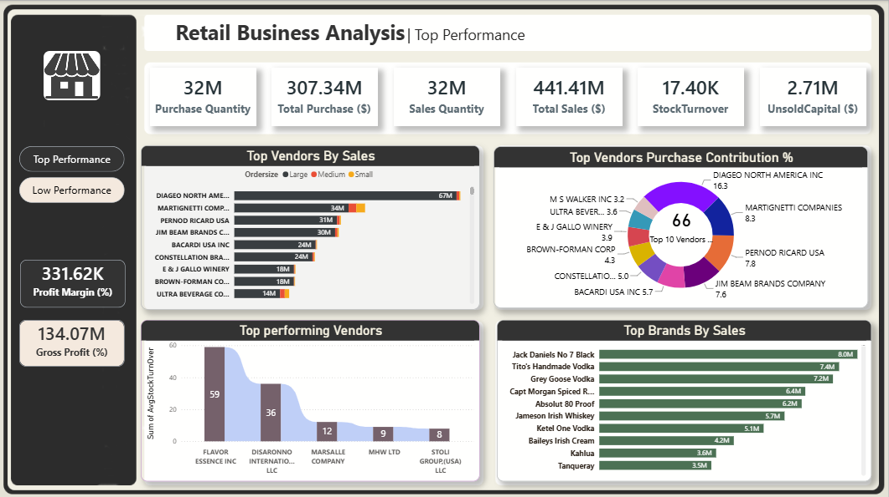
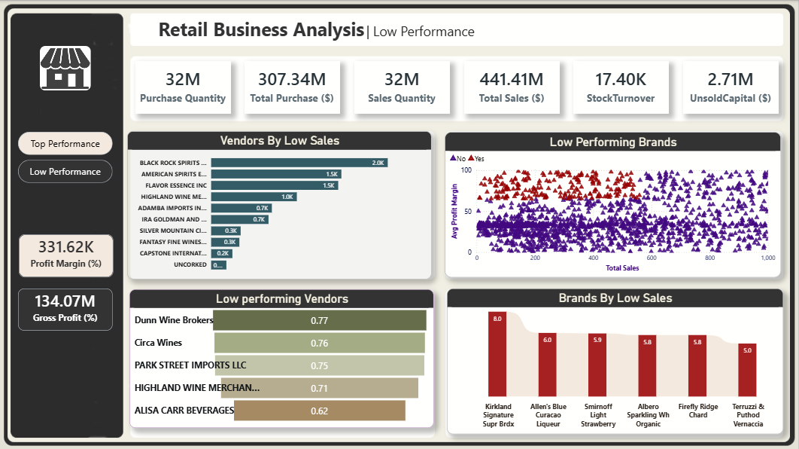

# Retail Business Performance Analysis

An end-to-end business intelligence project that evaluates retail vendor, brand, sales, purchasing, and inventory performance. The project combines **SQL**, **Python**, and **Power BI** to turn transaction-level data into actionable recommendations for procurement, pricing, promotions, and stock management.

## Table of Contents

- [Business Objective](#business-objective)
- [Dashboard Preview](#dashboard-preview)
- [Key Performance Indicators](#key-performance-indicators)
- [Key Insights](#key-insights)
- [Data Workflow](#data-workflow)
- [Tools Used](#tools-used)
- [Repository Structure](#repository-structure)
- [How to Run](#how-to-run)
- [Recommendations](#recommendations)

## Business Objective

Retail decisions become harder when purchase, sales, inventory, pricing, freight, and vendor data are stored separately. This project answers the following business questions:

- Which vendors and brands generate the most sales?
- Which low-selling brands have strong margins and may benefit from promotion?
- How concentrated is procurement spending among the leading vendors?
- Does larger order size reduce unit purchasing cost?
- Which vendors have the largest amount of unsold stock?
- How do profit margins differ between top- and low-performing vendors?

## Dashboard Preview

### Top Performance



### Low Performance



The Power BI report provides two focused views for comparing vendor and brand performance. It includes sales rankings, purchase contribution, stock turnover, profit margin, gross profit, unsold capital, and low-performance opportunity analysis.

## Key Performance Indicators

| Metric | Value |
| --- | ---: |
| Purchase Quantity | 32M |
| Total Purchases | $307.34M |
| Sales Quantity | 32M |
| Total Sales | $441.41M |
| Stock Turnover | 17.40K |
| Unsold Capital | $2.71M |
| Profit Margin | 331.62K |
| Gross Profit | $134.07M |

> KPI values are displayed as they appear in the Power BI dashboard.

## Key Insights

- High-performing vendors account for a material share of revenue, making their relationships strategically important.
- Procurement spend is concentrated in the top vendors, creating supplier-dependency risk and an opportunity to diversify sourcing.
- Larger order quantities generally have lower unit costs, although bulk buying should be balanced against inventory holding costs.
- Certain brands pair low sales with high profit margins. These are candidates for targeted promotions, pricing review, or broader distribution.
- Unsold stock ties up working capital; vendor-level inventory review can improve cash flow and purchasing decisions.
- The confidence-interval analysis found higher average margins for low-performing vendors (40.48%–42.62%) than top-performing vendors (30.74%–31.61%), suggesting different pricing, volume, or operating strategies.

## Data Workflow

```text
Source tables
  (purchases, sales, purchase prices, vendor invoices)
        ↓
SQL aggregation and joins
        ↓
Business_Performance_summary in SQLite
        ↓
Python cleaning, EDA, visual analysis, and confidence intervals
        ↓
Power BI dashboard for top and low performance monitoring
```

### Data Preparation

The analysis creates a vendor-and-brand-level summary by joining purchase, sales, price, and freight data. It derives the following business measures:

- **Gross Profit** = Total Sales Dollars − Total Purchase Dollars
- **Profit Margin** = Gross Profit ÷ Total Sales Dollars × 100
- **Stock Turnover** = Total Sales Quantity ÷ Total Purchase Quantity
- **Sales-to-Purchase Ratio** = Total Sales Dollars ÷ Total Purchase Dollars
- **Unsold Inventory** = Total Purchase Quantity − Total Sales Quantity

For the performance analysis, records with non-positive gross profit, profit margin, or sales quantity are excluded. Missing values are filled, categorical whitespace is trimmed, and volume is converted to a numeric data type.

## Tools Used

| Tool | Purpose |
| --- | --- |
| SQLite / SQL | Querying source tables, CTEs, joins, aggregation, and summary-table creation |
| Python | Data cleaning, exploratory analysis, visualizations, and statistical analysis |
| Pandas & NumPy | Data manipulation and calculation |
| Matplotlib & Seaborn | Analytical visualizations |
| SciPy | Confidence-interval and hypothesis-testing support |
| Power BI | Interactive dashboards and KPI reporting |

## Repository Structure

```text
Retail Business Performance Analysis/
├── Dashboard/
│   ├── Business Performance Summary.csv
│   └── Retail Business Performance Analysis.pbix
├── Images/
│   ├── Top.png
│   └── Low.png
├── Notebooks/
│   ├── Business Performance Analysis.ipynb
│   └── EDA.ipynb
├── Scripts/
│   ├── get_vendor_summary.ipynb
│   └── Ingestion_db.py
├── inventory.db
└── README.md
```

## How to Run

1. Clone this repository.

   ```bash
   git clone https://github.com/<your-username>/retail-business-performance-analysis.git
   cd retail-business-performance-analysis
   ```

2. Install the Python dependencies.

   ```bash
   pip install pandas numpy matplotlib seaborn scipy
   ```

3. Run [`Scripts/Ingestion_db.py`](Scripts/Ingestion_db.py) if you need to recreate or load the SQLite database.

4. Open and run the notebooks in this order:
   - [`Notebooks/EDA.ipynb`](Notebooks/EDA.ipynb) — creates and cleans the consolidated `Business_Performance_summary` table.
   - [`Notebooks/Business Performance Analysis.ipynb`](Notebooks/Business%20Performance%20Analysis.ipynb) — conducts performance analysis, visualizations, and statistical comparison.

5. Open [`Dashboard/Retail Business Performance Analysis.pbix`](Dashboard/Retail%20Business%20Performance%20Analysis.pbix) in Power BI Desktop. Refresh the data source if necessary.

## Recommendations

1. **Strengthen high-value vendor relationships** while monitoring dependence on a small supplier group.
2. **Diversify procurement sources** to reduce operational and supply-chain risk.
3. **Promote high-margin, low-sales brands** through targeted campaigns, bundles, or distribution improvements.
4. **Review slow-moving inventory** and use clearance, repricing, or purchase-plan adjustments to release tied-up capital.
5. **Use bulk-purchase savings selectively**, evaluating expected sell-through and holding costs before increasing order volume.
6. **Review low-performing vendors with high margins** to identify whether marketing, pricing, assortment, or availability is limiting volume.

---

If you found this project useful, please consider starring the repository.
